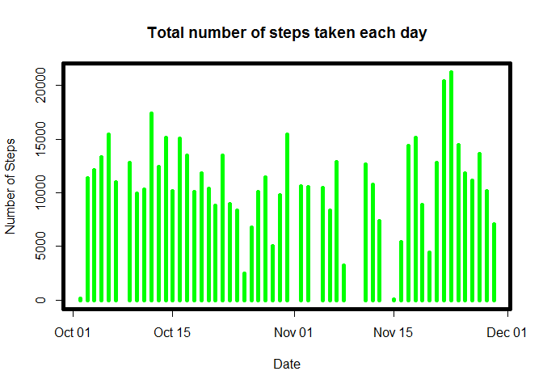
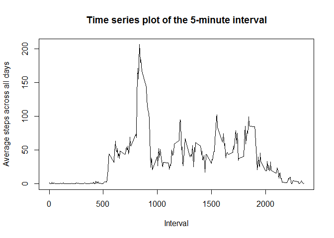
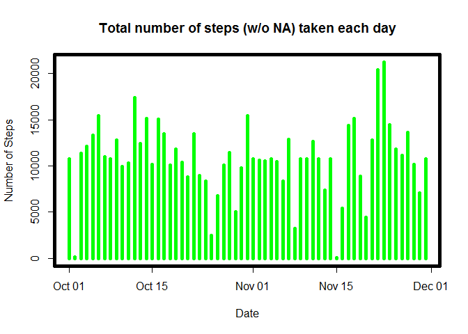
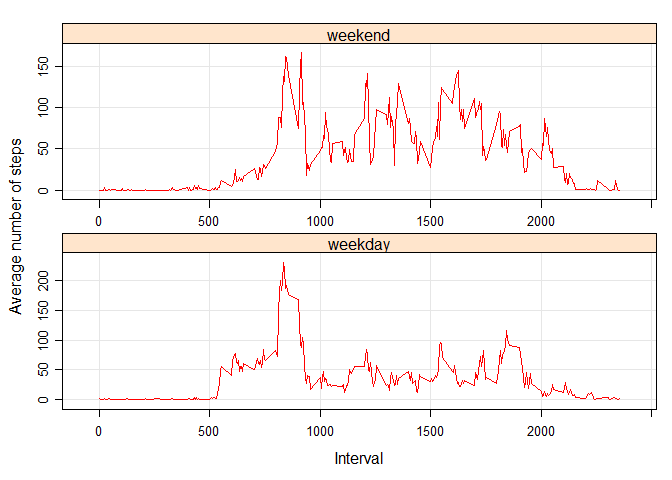

# Reproducible Research: Peer Assessment 1

```r
library(plyr)
```

```
## Warning: package 'plyr' was built under R version 3.1.2
```

```r
library(lattice)
```

## Loading and preprocessing the data

```r
#1. Load the data (i.e. read.csv())
activity <- read.csv("activity.csv",head=TRUE,sep=",", 
                     colClasses=c('numeric', 'character','numeric'),
                     stringsAsFactors=FALSE)
#2. Process/transform the data (if necessary) into a format suitable for your analysis
subset0 <- ddply(na.omit(activity), .(date), summarize, stepsPerDay=sum(steps))

subset0$date <- as.Date(subset0$date)
```

## What is mean total number of steps taken per day?

```r
#1. Make a histogram of the total number of steps taken each day
par(lwd = 5)
plot(subset0$date, subset0$stepsPerDay, col = "green", type="h", main = 
     "Total number of steps taken each day", xlab = "Date", ylab = "Number of Steps")
```

 

```r
#2. Calculate and report the mean and median total number of steps taken per day
mean <- round(mean(subset0$stepsPerDay), 2)
median <- round(median(subset0$stepsPerDay), 2)
cat("Mean Value is", mean)
```

```
## Mean Value is 10766.19
```

```r
cat("Median Value is", median)
```

```
## Median Value is 10765
```

## What is the average daily activity pattern?

```r
#1. Make a time series plot (i.e. type = "l") of the 5-minute interval (x-axis) and the average number of steps taken, averaged across all days (y-axis)

subset1 <- ddply(na.omit(activity), .(interval), summarize, AverageSteps = 
                  mean(steps))
plot(subset1$interval, subset1$AverageSteps, type = "l", main = 
       "Time series plot of the 5-minute interval", xlab = "Interval", ylab =
       "Average steps across all days")
```

 

```r
#2. Which 5-minute interval, on average across all the days in the dataset, contains the maximum number of steps?

maximumNumSteps <- max(subset1$AverageSteps)
maximum5minInterval <- subset(subset1, AverageSteps == maximumNumSteps)[1,1]
maximum5minInterval
```

```
## [1] 835
```

## Inputing missing values

```r
#1. Calculate and report the total number of missing values in the dataset (i.e. the total number of rows with NAs)
sum(!complete.cases(activity))
```

```
## [1] 2304
```

```r
#2. Devise a strategy for filling in all of the missing values in the dataset. The strategy does not need to be sophisticated. For example, you could use the mean/median for that day, or the mean for that 5-minute interval, etc.
#3. Create a new dataset that is equal to the original dataset but with the missing data filled in.

newActivity <- activity
newActivity[is.na(newActivity$steps),]$steps <- subset1[match(newActivity
                  [is.na(newActivity$steps),]$interval, subset1$interval), 2]

#4 Make a histogram of the total number of steps taken each day and Calculate and report the mean and median total number of steps taken per day. Do these values differ from the estimates from the first part of the assignment? What is the impact of imputing missing data on the estimates of the total daily number of steps?
subset2 <- ddply(na.omit(newActivity), .(date), summarize, stepsPerDay=sum(steps))

subset2$date <- as.Date(subset2$date)
par(lwd = 5)
plot(subset2$date, subset2$stepsPerDay, col = "green", type="h", main = 
     "Total number of steps (w/o NA) taken each day", xlab = "Date", ylab = "Number of Steps")
```

 

```r
# Calculate and report the new mean and new median total number of steps taken per day
newMean <- round(mean(subset2$stepsPerDay), 2)
newMedian <- round(median(subset2$stepsPerDay), 2)
cat("New Mean Value is", newMean)
```

```
## New Mean Value is 10766.19
```

```r
cat("New Median Value is", newMedian)
```

```
## New Median Value is 10766.19
```
## Are there differences in activity patterns between weekdays and weekends?

```r
#1. Create a new factor variable in the dataset with two levels - "weekday" and "weekend" indicating whether a given date is a weekday or weekend day.
newActivity$date <- as.Date(newActivity$date)
newActivity$typeofday <- ifelse(((weekdays(newActivity$date, abbreviate = F) %in% c('Saturday', 'Sunday'))), 'weekend', 'weekday')
newActivity$typeofday <- as.factor(newActivity$typeofday)

#2. Make a panel plot containing a time series plot (i.e. type = "l") of the 5-minute interval (x-axis) and the average number of steps taken, averaged across all weekday days or weekend days (y-axis). See the README file in the GitHub repository to see an example of what this plot should look like using simulated data.
subset3 <- ddply(newActivity, .(interval, typeofday), summarize, AverageSteps = mean(steps))
xyplot(AverageSteps ~ interval | typeofday, data = subset3, type = "l", layout=c(1,2), 
       xlab = 'Interval', ylab = 'Average number of steps', grid=TRUE, col= "red", scales="free")
```

 
